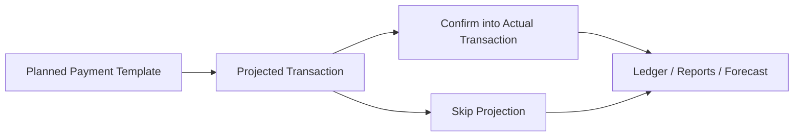

# FinFlow

[](https://github.com/popiposter/finflow/actions/workflows/ci.yml)


FinFlow is a personal finance workspace built around one practical idea: keep actual transactions, future expectations, and cashflow reading in the same system.

The repo already includes:
- a FastAPI backend with recurring finance domain logic
- a mobile-first React PWA frontend
- a one-command Docker dev stack for local work

## Why It Exists

Most finance apps split reality and planning into separate places. FinFlow treats them as one workflow:
- record what already happened
- model what is likely to happen next
- confirm or skip projected rows
- read cashflow across both layers

That is why the product is built around a projection-first lifecycle instead of direct recurring transaction generation.

## Lifecycle



## Current Scope

FinFlow currently supports:
- auth with browser session cookies and refresh flow
- accounts, categories, and actual transaction CRUD
- transaction patch editing
- parse-and-create ingestion from free-form text
- optional Ollama-backed LLM fallback for ambiguous text parsing
- bulk import of actual transactions from `.xlsx`
- planned payment templates
- projected transactions with edit, confirm, and skip flows
- scheduler-backed recurring projection generation
- P&L, cashflow, unified ledger, and forecast reads
- installable frontend PWA with offline read cache
- localized frontend UX in English and Russian
- normalized API error handling, localized validation, and a React error boundary

## Stack

- Backend: FastAPI, SQLAlchemy async, Alembic, PostgreSQL, uv
- Frontend: React, TypeScript, Vite, TanStack Query, React Hook Form, Zod
- PWA: service worker + installable app shell
- CI: GitHub Actions
- Local orchestration: Docker Compose

## Quick Start

### Fastest local path

From the repo root:

```bash
docker compose up --build
```

This starts:
- PostgreSQL on `localhost:5432`
- backend on `http://127.0.0.1:8000`
- frontend on `http://127.0.0.1:5173`

PowerShell helper:

```powershell
./scripts/dev/up-local-stack.ps1
```

### Frontend-only workflow

```bash
cd frontend
npm install
npm run dev
```

Frontend validation:

```bash
cd frontend
npm run typecheck
npm run test:run
npm run build
```

### Backend checks

```bash
./scripts/dev/check-backend.sh
./scripts/dev/assert-clean-git.sh
```

If `ruff` is installed locally:

```bash
cd backend
ruff check .
ruff format .
```

## Repo Guide

- [IMPLEMENTATION.md](IMPLEMENTATION.md) — delivery status and next likely steps
- [backend/README.md](backend/README.md) — backend workflow and checks
- [docs/testing-architecture.md](docs/testing-architecture.md) — test and CI rules
- [docs/spec/backend.md](docs/spec/backend.md) — backend behavior and API conventions

## Practical Notes

- Backend and frontend are intended to run on the same origin in production-style setups.
- Offline behavior is read-only by design for now; mutations are intentionally blocked without a connection.
- `.xlsx` import currently expects the first sheet in `date / description / amount` order.
- LLM parsing is feature-flagged and currently augments `parse-and-create` only when heuristics cannot confidently extract an amount.
- Error responses use a normalized envelope so the frontend can localize and map them consistently.

## Status

FinFlow is no longer a backend skeleton. The current `main` branch already supports the full core loop:
- enter or import actual transactions
- define recurring templates
- generate and manage projections
- confirm forecasted rows into actual history
- read reports and cashflow from the same workspace

The next work is product refinement rather than missing foundation.
